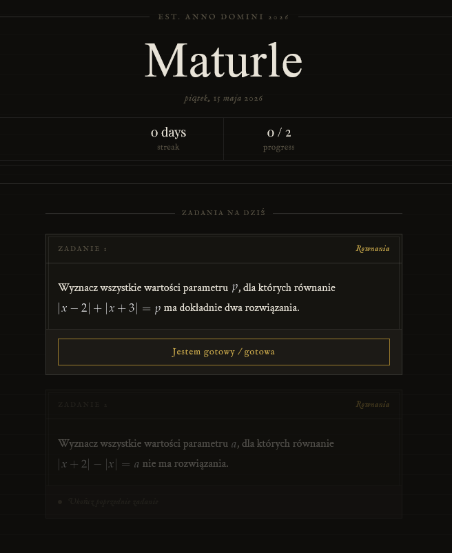
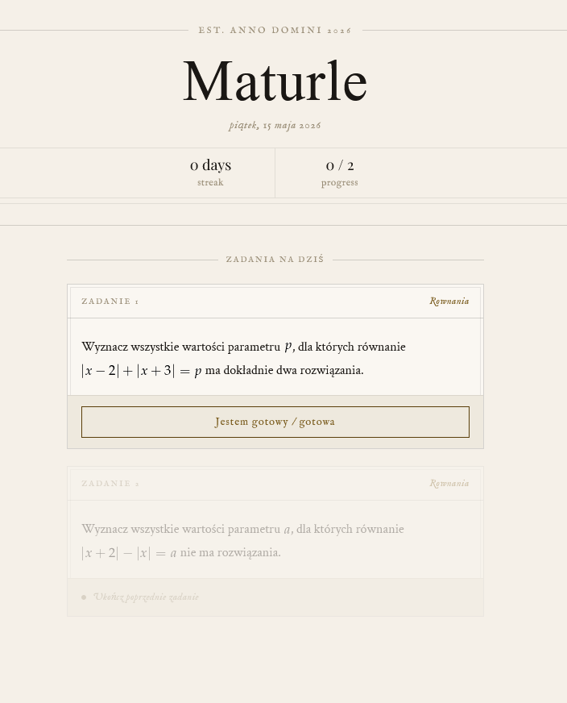

# Maturle
A wordle-like game to gamify and ease preperations for polish Matura exams.

## How does it work?
Each day, 2 questions are pulled directly from the questions.json file. The user has to solve the both of the questions in order they are given. After completing a question, the user has to manually choose his score: green for a perfect clear with no signs of struggle, yellow for struggling but still being able to solve, and red for not being able to solve the question. Completing questions every single days builds a streak.
Currently, only Math (advanced level) is available, but after some time more subjects will become available.

## How are questions fetched?
If you want to scrape the questions yourself, a python scraper will be provided in the future that allows so. In detail, the scraper goes over every question category on [this website](https://zadania.info/) and fetches questions on each page directly as html to preserve the latex notation and saves it directly to the json file on each category save. 

## Preview
### Dark mode

### Light mode

